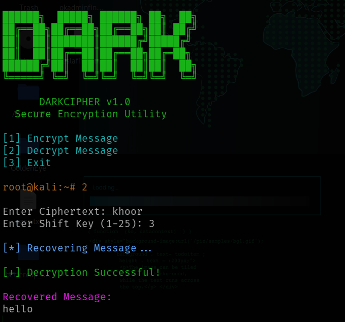
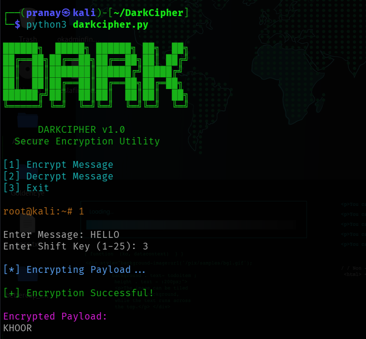

# 🔒 DarkCipher – Caesar Cipher Tool

## 📖 Description

DarkCipher is a Python-based encryption and decryption tool that implements the Caesar Cipher algorithm. It allows users to securely encrypt and decrypt messages using a custom shift key.

---

## ✨ Features

* Encrypt text messages
* Decrypt encrypted messages
* User-defined shift key
* Hacker-style terminal interface
* Colorized output using Colorama

---

## 🛠️ Installation

```bash
pip install colorama
python3 darkcipher.py
```

---

## ▶️ Usage

Run:

```bash
python3 darkcipher.py
```

Choose:

* Encrypt Message
* Decrypt Message
* Exit

---

## 📸 Screenshot




---

## 📚 Skills Learned

* Caesar Cipher Algorithm
* Cryptography Basics
* Python Functions
* String Manipulation
* Command-Line Application Development

---

## 👨‍💻 Author

Pranay Jain
