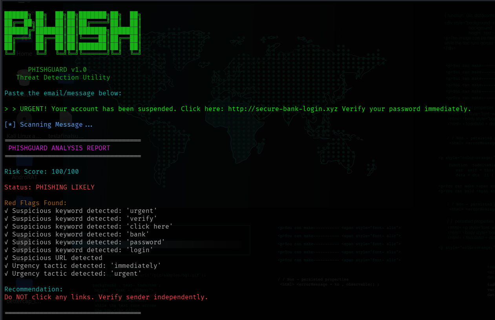

# 🛡️ PhishGuard – Phishing Awareness Analyzer

## 📖 Description

PhishGuard is a Python-based command-line tool that analyzes email or message content for phishing indicators. It identifies suspicious keywords, detects URLs, calculates a risk score, and provides security recommendations.

---

## ✨ Features

* Detects phishing-related keywords
* Identifies suspicious URLs
* Generates a phishing risk score
* Displays detected red flags
* Provides security recommendations
* Colorized hacker-style terminal interface

---

## 🛠️ Installation

```bash
pip install colorama
python3 phishguard.py
```

---

## ▶️ Usage

Run:

```bash
python3 phishguard.py
```

Paste an email or message and let the tool analyze it.

---

## 📸 Screenshot



---

## 📚 Skills Learned

* Phishing Detection
* Social Engineering Awareness
* Pattern Matching
* Python Scripting
* Cybersecurity Fundamentals

---

## 👨‍💻 Author

Pranay Jain
